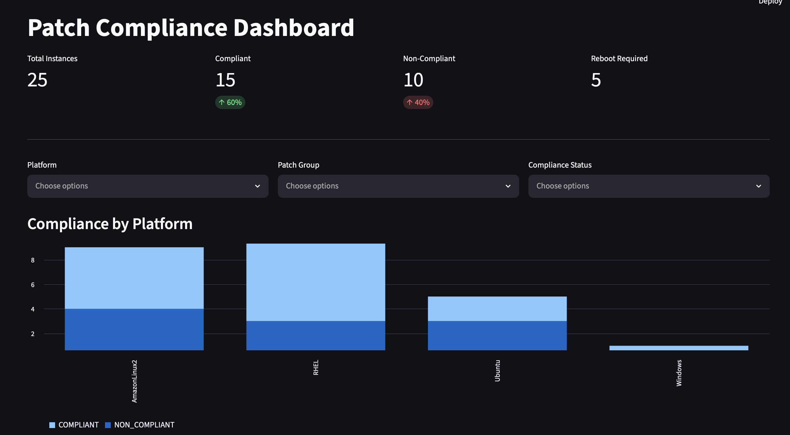

# Patch Compliance Dashboard

**A cloud-native patch compliance auditing platform for mixed Windows/Linux fleets, built on AWS Systems Manager Patch Manager.**

[Live demo](#) · [Case study](#) · [Architecture](docs/architecture.md)



---

## Why this project

Enterprises running mixed Windows/Linux fleets need visibility into patch
compliance for security audits, but Windows Cumulative Updates and Linux
package updates are tracked completely differently at the OS level. Rather
than writing brittle per-OS shell scripts, this project treats **AWS SSM
Patch Manager** as the source of truth — it already normalizes both into
one compliance model — and builds an auditing dashboard on top of it.

It was built to demonstrate, end-to-end, the kind of platform engineering
work a Cloud/DevOps role actually involves: not just "can you write
Python," but architecture decisions under real constraints (cost,
ops overhead, testability) and the infrastructure to ship and run it.

## Tech stack

| Layer | Choice |
|---|---|
| Patch data source | AWS SSM Patch Manager |
| Compute (collector) | AWS Lambda, triggered by EventBridge Scheduler |
| Storage | DynamoDB (on-demand, single-table design) |
| Dashboard | Streamlit, hosted free on Streamlit Community Cloud |
| IaC | Terraform (modular: dynamodb / lambda / eventbridge / IAM) |
| CI/CD | GitHub Actions, OIDC-authenticated (no stored AWS keys) |
| Language | Python 3.12, manual dependency injection via `typing.Protocol` |

## Architecture

- **Collection**: EventBridge Scheduler → Lambda → SSM Patch Manager API → DynamoDB (all AWS-native)
- **Serving**: Streamlit Community Cloud, deployed free directly from this GitHub repo, reads from
  DynamoDB using a scoped-down IAM user's access keys stored in Streamlit's secrets manager
- **Storage**: DynamoDB, single-table design, on-demand billing (permanent free tier at this scale)
- Full writeup, diagrams, and decision rationale: [`docs/architecture.md`](docs/architecture.md)

## Engineering decisions worth highlighting

These were deliberate tradeoffs, not defaults — happy to walk through the reasoning on any of them:

- **DynamoDB over RDS** — Streamlit Community Cloud hosting rules out App Runner/ECS
  (no free tier once idle), and App Runner ruled out RDS: connecting to RDS would need a
  VPC Connector, which typically means a NAT Gateway (~$32/mo) just for networking. DynamoDB
  needs no VPC at all — both Lambda and the dashboard reach it over public AWS endpoints.
- **Dependency injection via `typing.Protocol`, not a DI framework** — every service depends
  on an interface (`PatchDataSource`, `PatchRepository`), never a concrete AWS class. This
  means the full test suite (`common/tests`) runs with **zero AWS credentials** — CI never
  needs a single secret to lint and test every PR.
- **Mock-first development** — `MockPatchSource` generates data shaped identically to real
  SSM API responses, so switching to production data is a one-line env var change, not a
  rewrite. The entire dashboard was built and demoed before any AWS account was involved.
- **Cost-conscious infrastructure** — Terraform is designed for spin-up/spin-down demo usage
  rather than 24/7 infrastructure, and Streamlit Community Cloud sidesteps AWS's lack of a
  genuinely free always-on compute/hosting tier.

## Repository layout

```
common/patch_domain/       # Shared domain package — models, Protocol interfaces,
                            # sources (Mock/SSM), repositories (InMemory/DynamoDB), services
lambda/patch_collector/    # Lambda composition root — wires source+repository, runs scans
app/                        # Streamlit dashboard composition root — wires repository, serves UI
terraform/
  modules/                  # Reusable building blocks: dynamodb, lambda, eventbridge, streamlit_access
  environments/demo/        # Wires modules together with actual settings
  bootstrap/                 # One-time setup: creates the S3/DynamoDB backend for terraform state
.github/workflows/
  ci.yml                     # Lint + test on every PR — no AWS credentials needed
  deploy-infra.yml            # Manual: terraform apply/destroy via OIDC
  deploy-app.yml                # Ships the Lambda collector (dashboard auto-deploys via Streamlit Cloud)
scripts/                     # LocalStack setup/seeding, demo teardown
```

## Testing philosophy

Because every service is written against `PatchDataSource`/`PatchRepository`
interfaces rather than concrete AWS classes, tests inject `MockPatchSource`
and `InMemoryRepository` directly — no mocking library, no AWS credentials,
no network calls:

```python
def test_run_scan_persists_all_instances():
    source = MockPatchSource(fleet_size=10, seed=1)
    repository = InMemoryRepository()
    service = PatchAuditService(source, repository)

    assert service.run_scan() == 10
```

For the one thing that genuinely needs real AWS-shaped behavior — DynamoDB's
single-table writes and GSI query — LocalStack fills the gap (see below)
without needing a real AWS account.

## Getting started (local, mock data)

```bash
pip install -e "./common[dev]" --config-settings editable_mode=compat
pytest common/tests lambda/patch_collector/tests app/tests

export USE_MOCK_DATA=true
pip install -r app/requirements.txt
streamlit run app/dashboard.py
```

> **Note**: `--config-settings editable_mode=compat` forces the older
> `.pth`-file-based editable install instead of setuptools' newer meta-path-finder
> style, which can silently fail to resolve `patch_domain` on some environments
> (`pip show` reports success, but `import patch_domain` still raises
> `ModuleNotFoundError`). If you hit that specific mismatch, reinstall with this flag.

## Local testing against LocalStack (no AWS account needed)

```bash
./scripts/setup_localstack.sh
python scripts/seed_localstack.py

export USE_MOCK_DATA=false
export USE_LOCALSTACK=true
streamlit run app/dashboard.py
```

## Deploying to AWS

```bash
# One-time: create the Terraform state backend
cd terraform/bootstrap && terraform init && terraform apply

# Provision infrastructure (or trigger deploy-infra.yml in GitHub Actions)
cd terraform/environments/demo && terraform init && terraform apply
```

Lambda code ships via `deploy-app.yml` on every push. The dashboard itself
needs no deploy step — see below.

## Deploying the dashboard to Streamlit Community Cloud

1. Push this repo to GitHub
2. On share.streamlit.io, create a new app pointing at `app/dashboard.py`
3. In Settings → Secrets, paste `terraform output streamlit_access_key_id` and
   `terraform output -raw streamlit_secret_access_key` (format: `app/.streamlit/secrets.toml.example`)
4. Every push to `main` auto-redeploys

**Security note**: Streamlit Cloud runs outside AWS, so it authenticates with
a static IAM user's access keys rather than an assumed role. That user is
scoped to read-only access on exactly one DynamoDB table. Rotate periodically;
never commit `secrets.toml` (gitignored).

## Required GitHub secrets

| Secret | Purpose |
|---|---|
| `AWS_DEPLOY_ROLE_ARN` | IAM role assumed via OIDC — no static keys stored for the Lambda deploy |
| `TF_STATE_BUCKET` | S3 bucket created by `terraform/bootstrap` |
| `TF_LOCK_TABLE` | DynamoDB lock table created by `terraform/bootstrap` |

## Roadmap

- [ ] Trend/history views using the `SCAN#<timestamp>` items already being written
- [ ] CloudWatch alarm on Lambda scan failures
- [ ] Flip `USE_MOCK_DATA=false` against a real AWS account once available